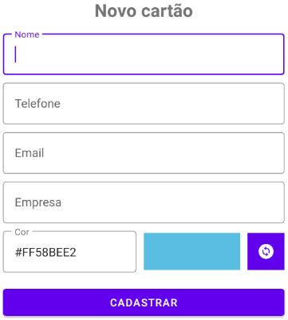

# Exercício - App de Cartão de Visitas em Kotlin

Aplicativo de lista de cartão de visita onde é possível guardar os dados de contato de uma pessoa. O dados armazenados são nome, empresa, telefone de contato, email e cor de fundo do cartão utilizando banco de dados SQLite/Room.

Este aplicativo feito como exercício do curso da Digital Innovation One.

Em relação ao projeto ensinado em aula virtual, eu fiz as seguintes alterações:

- Adicionei ícones de telefone e email no Item_Business_Card;
- Diminui os espaçamentos na listagem de visualização do cartões;
- Alterei os ícones do aplicativo;
- Alterei o código para que uma cor fosse escolhida automática e aleatoriamente ao chamar a UI de adição de novo cartão;
- Inclui um botão para alterar ao lado do campo texto Cor para mudar a cor aleatoriamente. E junto ao botão adicionei um ImageView para visualizar a cor escolhida.

## Screenshots

Ícones de telefone e email

Formulário de inclusão de cartão com visualização de cores para o cartão

Novo ícone de aplicativo

## Sobre o Autor

Oi, sou o Roberto. Estou aqui aprendendo a criar aplicativos Android utilizando Kotlin.

 

## Tecnologias utilizadas

1. Room
2. MVVM
3. ViewBinding
4. LiveData
5. ListAdapter
6. Material Design

## Descrição

1. Preparação do ambiente e criação do nosso App
3. Montando layout do projeto
5. Configuração do room database
7. Compartilhamento de cartão de visita
